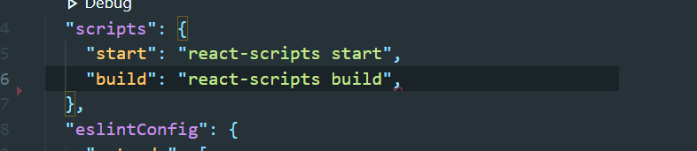
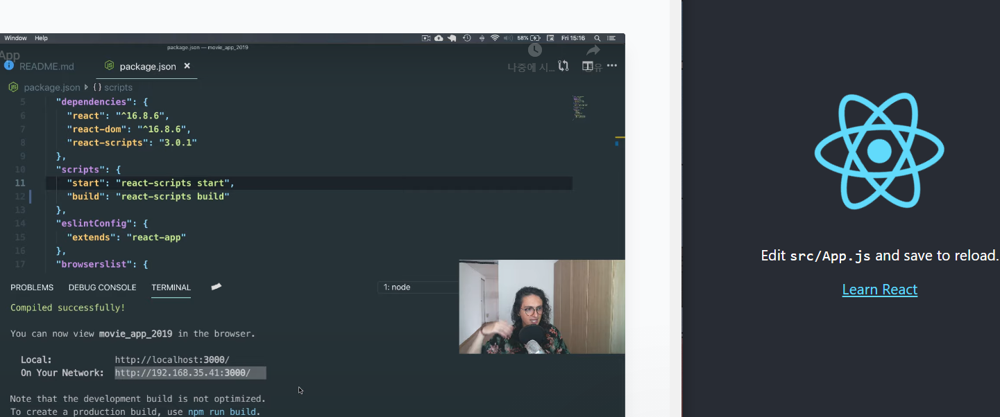

# 시작전

- HTML = content가 어떻게 생겼는지 브라우저에게 설명해 주는 것

- CSS = Cascading Style Sheets → HTML을 꾸며주는것(디자인)

html이 어떤 컨텐츠인지 알려주면 css는 색, 크기등을 지정해주는 것

- Javascript= 웹사이트의 뇌를 담당

웹사이트 띄우기

VSCODE에 HTML주소로 링크된 파일들이 생성될 폴더를 드래그해 넣는다.

파일명, 폴더명은 소문자로 작성한다.

# HTML

개발자가 실수 하더라도 페이지에 접속한 유저는 알아차릴수 없다는 장점

브라우저가 잘못 되더라도 에러가 나타나지않는 단점

HTML의 목적- 브라우저한테 뭐가 뭔지 알려주는것

TAG를 이용하여 TEXT와 LINK 넣는 것

태그의 사이에 들어가는 것만  취급

H1태그 : 글자 크기를 H1로 지정함

닫는태그는 /를 앞에 붙여 주어야 한다

H태그는 1~6까지 존재한다

HTML에서 리스트를 표현하는 두가지 방법

ul: unordered list

ol: ordered list

li: list item

prettier을 사용하면 틀린 문법을 자동으로 고쳐줌

프로그램 확장에 prettier 인스톨 → Editor : Format on save 체크하기

# a태그

<a href="http://google.com">Go to google.com</a>  

<a href="http://google.com" target="_blank">Go to google.com</a>
새 창에서 링크가 열림

 이미지를 넣는 태그
 로컬파일을 이용한 이미지 삽입

<!DOCTYPE html> = HTML타입이라고 알려주는 것

# head태그
mate 태그는 self-closing태그이다
meta 태그는 content와 name 두가지의 attribute를 가지고 있다.
meta charset="utf-8" 를 넣어야 브라우저가 택스트를 어떻게 그려 넣을지 알수있음
html lang="kr" = 우리 사이트가 어떤 언어를 사용하는지 알려줌

2월 2일

html태그들
html tags mdn 검색 시 firefox 브라우저를 만드는 회사가 제공하는 정보들을 정리한 문서가 나옴

 = paragraph 태그

-여러가지 태그들-
<pre> </pre> = pre formated 태그
<abbr> </abbr>

쓰고싶은말 <abbr title="Cascading Style Sheets">CSS</abbr>

약칭의 의미는 title에 적어주고 약어는 content에 넣는다
-> 안녕하세요 글자에 마우스를 올리면 약어의 원말을 알려준다

<cite></cite> 기울임 체로 바꿔준다
<mark></mark> 컬러로 텍스트를 감싼다
<strong></strong> 글자를 두껍게 바꿔준다
 글자위치를 위로 올려준다 ex) 
25

<audio controlls="enabled" autoplay src="mp3파일의 주소">
</audio> 자동으로 음악을 재생하도록 한다

MDN의 장점= 한국어로 변환 할 시 태그가 가지고있는 모든 attribute가 문서에 포험되어 있다

FORM태그

input태그
form태그 안에 input태그를 넣으면 택스트를 입력할 수 있는 박스가 생긴다

type을 통해 color나 password형태로 넣을수도 있다.

placeholder태그로 배경에 설명을 넣어줄 수 있다.
submit태그로 버튼을 만들어줄 수 있다.

value태그로 버튼의 내용을 바꾸어줄수도 있다

disabled태그로 input또는 submit버튼을 사용 불가능하게 바꿀 수 있다.

required를 placeholder에 추가하면 검증을 할 수 있다
(반드시 작성하도록 함)

minlength로 최소 글자수를 정할 수 있다.

type을 file로 하면 파일 업로드를 할 수 있다.
accept=".pdf" pdf파일만 선택할 수 있다.

#2.9
label태그는 input과 함께 작동한다
label에는 for input에는 id를 넣고 둘은 같아야한다
->for과 같은값을 가진 id를 들고있는 input태그를 작동시킨다.

art를 누르면 두군데 동시 작성 가능하다.
공백이 없어야한다

input에 type을
url로주면 url만 입력받을 수 있다.
email로 주면 email만 입력 받을 수 있다.
range로 주면 게이지로 설정
number로 주면 숫자만 입력 가능
hour로 주면 시간만 입력 가능

id는 고유해야하고 태그 하나당 하나만 가질 수 있다.

#2.10
div태그는 division의 약자
배치를 좌우가 아니라 위아래 하고싶을 때
div를 사용한다
->div라는 박스를 사용했기 때문

header, main, footer를 사용하여 묶어줄 수도 있다.

div태그로 전부 바꾸어줘도 괜찮다

span은 짧은 text를 위한 태그이다
안녕
<adrress>태그를 사용해서 주소인것을 알려주면 훨씩 빠르게 파악할 수 있다
문단은 p태그가 적합하다

되도록이면 의미있는 box를 사용할 것

#2.11
sementic태그들은 코드자체에 의미가 부여되어있는 것

header main footer 모드 container이다.

CSS
#3.0
CSS를 적용시키는 방법 두가지
1. HTML코드와 CSS코드를 같은 HTML파일에 놓는 방법
2. CSS와 HTML을 분리시키는 방법

1. 같이 두는 방법
style 태그를 사용하여 꾸며주고 style태그로 닫는다
2. 따로 두는 방법
style.css 파일을 따로 만든다 
link href="style.css" rel="stylesheet" 를 이용해서 관계를 표시해준다.

분리시키는 방법을 사용할 경우 더 많은 html에서 css파일을 사용할 수 있다는 장점이 있다.
또한 CSS내용이 길어지더라도 분리된 파일을 가지고있으면 보기좋다

#3.1
CSS코드는 HTML 태그는 가르키는 일
가르키는것 자체를 selector이라고 한다

1. HTML로 정해줬던 셀렉터중 하나를 지정한다

2. 속성값을 넣어준다

#3.2
CSS 의 Cascade의 의미는 순서대로 일을 처리한다는 뜻
따라서 가장 마지막에 작성한 코드를 받아들여 덮어쓰게된다. 
따라서 같은 h1 태그를 여러번 쓸 수 있지만 모아두는게 좋은 방법이다.

#3.3
어떤 웹 사이트던 그걸 이루는 모든 요소들은 box다

box들은 block으로 구성되어 있다.

block의 반대는 inline이다
span이나 link는 박스가 아니라 인라인에 속한다
아주 작은 글이나 링크, 그림 등등이 inline에 속한다

나머지는 block이다
block은 옆에 아무것도 올 수 없다.

#3.4
block만 가지고 있는 특징
block을 inline으로, inline을 block으로 바꾸기
display 속성을 통해 변환 가능하다

block을 inline으로 바꿨을때 높이와 너비는 적용되지 않는다
->inline은 높이와 너비를 가질 수 없기 때문
+ margin, padding, border도 마찬가지

margin은 box의 border로부터 바깥에 있는 공간

#3.5
margin: 상px 하px 좌px 우px; 를 통해 한번에 줄 수 있다.

*collapsing margin 현상
div 여러개의 위 아래쪽에 마진이 같으면 한번에 묶이는것
-> 해결하기 위해 padding사용

#3.6
padding은 margin과 반대개념
padding = box의 경계로부터 안쪽의 공간

*id에 스타일을 주려면 #ID 를 이용한다

#3.7
border
box의 경계를 말한다

border: 2px solid black;

세번째 div에 텍스트를 추가하려면 세번째에만 입력하면 된다

#3.8
inline은 높이와 너비가 없다

span은 위, 아래에 margin을 가질 수 없다. 좌 우만 가질수있음

이럴때 inline은 block으로 바꿔주어야한다.

CLASS
SELECTOR를 하나로 묶는 개념
class는 여러번 사용할 수 있다.

.tomato{
    내용
}

하나의 span이 여러개의 class를 가질 수 있다.

여러 코드를 한번에 수정하기 = ctrl + d

#3.9
inline-block을 사용하면 div옆에 div를 두면서 높이와 너비를 줄 수 있다.
div {
    display: inline-block;
}

inline-block은 요소 사이에 빈 공간이 생긴다
너비와 높이를 주면 빈 공간이 줄어든다....but
반응형 디자인을 지원하지 않는다.
-> 창 크기가 달라지면 달라진다.

#3.10
FLEXBOX
박스를 어느곳에서든 둘 수 있다. 2D에서 사용

자식에게 명시하지 않고 부모에게 명시한다 ex)body

justify-content: flex-end; : 끝으로
justify-contetn: space-evenly; : 빈 공간을 같은 크기로 나누어 배치한다
around, between 등등 알아서 계산해서 배치한다

justify-content는 주축
align-items는 교차축에 적용
주축과 교차축이 바뀔수도 있다

vh = viewport height
화면 크기에따라 바뀌는 단위이기 때문에
여러 기기에서 동일한 위치에 위치시킬 수 있다

#3.11

display를 flex로 했을 때 디폴트값은 row이다

flex-direction을 column으로하면 수직 수평이 바뀐다.
column-reverse 설정하면 순서가 밑에서부터 위로 바뀐다.

#3.12
position 레이아웃 보다는 위치를 아주 조금씩 옮기고 싶을 때 사용한다.

div의 포지션을 fixed로하면 스크롤을 내려도 박스 위치는 그자리에 그대로 위치한다

- div에 id를 주고 position: fixed;를 사용하면
레이어를 무시하고 다른 레이어에 위치해 있는다 ex)넷플릭스 메뉴
- top bottom left right 중 하나만 수정하면
레이어 위에 위치하게 된다

#3.13
position: static; = 디폴트값
position relative; = element가 처음 위치한 곳을 기준으로 
position absolute; = 가장 가까운 relative 부모를 기준으로 이동시켜준다

박스를 absolute로 만들고 부모를 relative로 지정하면
부모 div안에서 absolute의 박스 위치가 이동된다

#3.14
pseudo selector
div:first-child, div:last-child 를 사용하면
div들에게 클래스나 아이디를 부여하지 않고도 변화를 줄 수 있다

여러 span이 나열되어 있어도 span:nth-child(2) 를 이용하여 두번째 span의 배경만 바꿀수도 있다.
nth-child(even)을 통해 even으로 설정하면
짝수번째 span들을 모두 컨트롤 할 수 있다.
odd는 홀수를 한번에 컨트롤 할 수 있다.

#3.15
p태그 안에있는 span을 수정할때
p span { }를 사용한다

div > span 으로 태그 지정하면 div 바로 밑의 자식인 span만 효과를 줄 수 있다

p + span 으로 태그를 지정하면
p테그에 포함된 span에 효과를 줄 수 있다

#3.16
pesudo element
p ~ span 으로 태그를 지정하면
형제인데 바로 뒤에 오지 않을 때 쓸수있다

required placeholder를 적용해준 input박스를 수정할때
input:required {
    border: 1px solid tomato;
}
input:required {
    border: 1px solid wheat;
}

type이 password인 input태그 수정하기
input[type="password"] {
    background-color: thistle;
}

placeholder가 username인 input태그 수정하기
input[placeholder="username"]{}

placeholder가 name을 포함한 태그 수정하기
input[placeholder~="name"] {}

#3.17
button:active 를 하면 클릭중일때의 효과를 줄 수 잇다
button:hover 를 하면 마우스를 버튼위에 올릴때 효과
button:focus 를 하면 키보드로 버튼을 선택할때 효과

visited 를 사용하면 방문했던 사이트의 주소태그 컬러에 효과를 줄 수 있다

#3.18
input::placeholder{
    color: red;
}
placeholder의 색깔을 바꿀 수 있다

p::selection {
    color: red;
}
스크롤 했을때 색깔을 넣을 수 있다.

#3.19
css의 색 표기법 3가지
영어표기, rgba, 숫자코드

#4.0
transition
state가 없는 요소에만 붙일 수 있다.

10초동안 변하는 트랜지션

#4.1
이미지를 3D로 회전시킬 수 있다
transform: translateX(-1000px);
transform: skew로 각도를 변화시킬 수 있다

#4.2
hover시에 각도를 바뀌게하고 transtorm을 입력하면 애니메이션처럼 움직이게 할 수 있다.

scale로 크기를 조절할 수 있다.

#4.3
특정 액션 없이도 자동으로 애니메이션이 재생되도록 할 수 있다.

#4.4
원하는 효과를 순서를 정해 반복재생 시킬수  있다

#4.5
media query = 오직 CSS만을 이용해서 스크린의 사이즈를 알 수 있는 방법

CSS만으로 감지할 수 있다.

600~750px사이의 스크린에서는 색을 빨강으로 바꾼다
@media screen and (min-width: 600px) and ( max-width: 750px) {
    div {
        background-color: toamto;
    }
}

#4.6
@media screen and (min-width: 601px) and ( max-width: 1200px) {
    div{
        background-color: wheat;
    }
}
- media quary가 참일 경우 가지고있는 div를 실행하는 코드이다
- 미디어쿼리는 and로 여러 조건을 함께 쓸 수 있다
- min-device-width는 모바일에서 사용 가능하다
- width-to-height 를 사용하면 스크린이 레티나 디스플레이인지 아닌지 구분할 수 있다=> 레티나는 더 나은 디스플레이를 사용할 수 있다

#5.0
GITHUB설치

#5.1
GITHUB란 GIT을 보관하고 변경 내역을 저장할 수 있는 역할

#5.2
GITHUB에 파일을 올리는 방법 두가지
1. 컴퓨터에 폴더를 만들고 그 폴더를 GITHUB에 올리는 방법

2. 처음부터 github내에 repository를 만들어주는 방법
repository name은 빈 공백없이 소문자로 작성해야한다

public으로 생성해야 공유하고 서로 도울 수 있다.
private로 설정하면 본인만 확인가능

이렇게되면 github에 repository가 생성되었지만 지금은 데스크톱에는 존재하지 않는다

연결하기 위해서 github desktop이라는 도구를 다운로드해야한다.

push to origin을 눌러서 데이터를 공유해서 저장시킨다

#6.0
- .gitignore = 무시하고 싶은 파일 이름을 기록하는 파일

#6.2
Block Element Modifier규칙

#6.3
- 아이콘을 추가하는 두가지 방법
- 아이콘을 구하는 방법 
heroicons,FontAwesome사이트 이용
- 직접이미지를 만들고 추출하거나 svg(픽셀이 없는 이미지 파일 형식)파일을 이용, 좌표로 되어있어서 원하는 만큼 늘릴수도 있다

이메일 입력하면 kit code를 보내준다

#6.5
css
head에 link만들기
link:css라고 치면 필요한게 생긴다

font-family: ;를 사용하면 쉽게 골라 사용할 수 있다.
다른 font가 필요하면 구글 폰트에서 다운

#6.6
css를 여러개 추가할 때에는
html을 여러줄로 나누기 보다는 기존 css파일에 @import를 사용하는것이 보기 깔끔하다

page ruler redux를 사용하면 정확한 거리를 잴 수 있다.

display: flex;를 사용하면 텍스트 위치를 지정할 수 있다.
flex-direction: column;을 사용하면 좌우로 배치된 태그들을 위아래로 배치할 수 있다.

align-items: center;를 사용하면 센터로 위치 지정이 가능하다

opacity 속성으로 투명도를 줄수있다
Open Sans를 찾아서 font-weight: 600;를 주어 글씨 굵기 조절가능하다

#6.7 
로그인폼 작업
로그인폼의 아이디를 선택자로 지정하고
display: flex;
flex-direction: column;으로 지정하면

margin: 0px 30px; 으로 여백 넓이 지정

#login-form input {
    border: none; //모든 input들의 border 삭제
    padding: 15px 0px;
    border-bottom: 1px solid black rgba(0, 0, 0, 0.2)로 입력창 아래의 바를 만들어준다
}
    

#login-form input ::placeholder {
    color: black; rgba(0, 0, 0, 0.4);
}

로그인 칸을 클릭했을때 주위 효과 없애기
#login-form input:focus{
    outline: none;
}

마우스버튼을 클릭했을때 border-bottom 색상이 바뀌도록 설정하기
#login-form input:focus {
    border-color: black rgba(0, 0, 0, 0.4);
}

또는 variables.css를 따로 만들어서
:root {
    --yellow: #fae100;
}
로 색을 지정해주고
variables.css파일을 style.css에서 반드시 import해주고 나면 다음과 같은 효과를 줄수있다
#login-form input:focus {
    border-color: var(--yellow);
}

input에
transition: border-color 0.3s ease-in-out;을 주면 효과가 천천히 바뀌는 것을 확인가능

#6.8
not속성

type이 submit이 아닐때만 transition이 적용된다

#login-form input:not([type="submit"]){
    border-bottom: 1px solid black rgba(0, 0, 0, 0.2);
    transition: border-color 0.3s ease-in-out;
}

다시 로그인폼으로 돌아와서 로그인 버튼 색상 변경하기
#login-form input[type="submit"] {
    background-color: var(--yellow);
    cursor: pointer; / not-allowed; / progress; 등으로 마우스를 올렸을때 모양을 변경할 수 있음
}

#6.9
form의 action으로 어떤페이지로 data를 보낼지 지정할 수 있다.

method는 POST방식과 GET방식을 사용할 수 있다.
POST는 백엔드 서버에 데이터를 전송하는 방식

GET은 보안에 취약하다. USERNAME과 PASSWORD를 GET방식으로 보내면 안된다.

nav>ul>li*4

#6.12
box-sizing: border-box;를 쓰는 이유
width 200px을주고 padding left: 50을 주면 css는 200을 유지하려고 가로길이를 늘린다
box-sizing: border-box; 를 사용하면 CSS가 content가 보일 부분을 늘리지 않는다

#6.13
span에 효과를 줄 때에는 display:block;을 주어야한다

position: absolute;는 가장 가까운
position: relative; 를 가진 부모 기준으로 움직인다

#6.18

리액트-----------------------------------------------------------------------------------------------------
node.js 설치
cmd창에서 node -v 를 입력하여 설치됐는지 확인한다.

npm 설치를 확인한다(node.js 설치시 같이 따라온다)
npm -v를 입력하여 npm이 설치되어있는지 확인한다.

npx를 설치한다
node.js와 npm설치를 확인한 후
npm install npx -g 를 입력하여 설치한다

vscode와 git을 설치
cmd에 git 치면 설치 확인 가능, git -v로 버전 확인 가능

리액트는 페이스북이 만들었다.
대부분의 회사들은 리액트를 사용한다.
리액트는 자바스크립트인 경우가 많다.
리액트가 사라진다고 하여도 자바스크립트의 지식은 사라지지 않는다는 장점이 있다.

react는 현대적인 코드와 작동한다
어리석은 Browser가 이 코드를 이해하지 못하기때문에 바꿔주어야한다.
create react app을 설치해서 복잡한 과정을 간단하게 React Wep App을 설치할수있다

package.json에서 알아야할 것들

tip. ctrl+j: 터미널 여는 단축키 ctrl+b: 익스플로러 여는 단축키

npm start 입력하면 새창이 열리면서 시작됨
